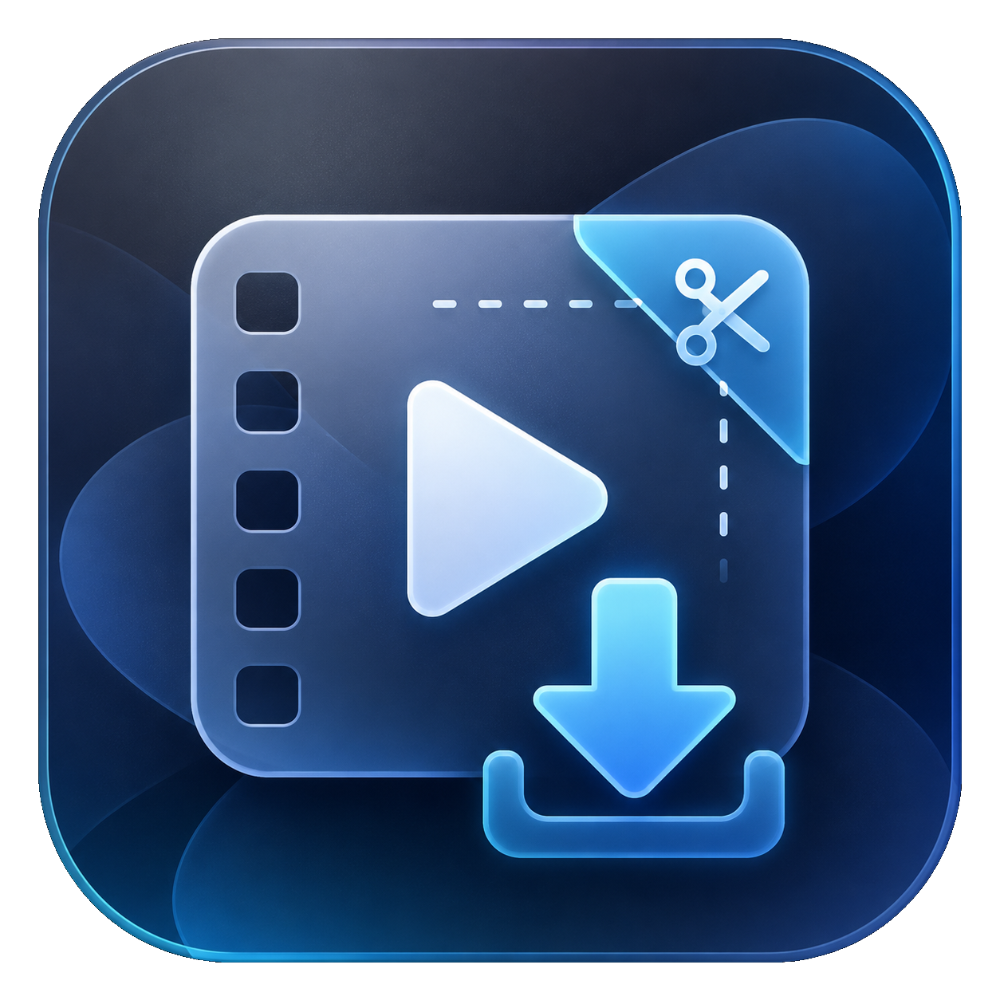

<p align="center"></p>

<h1 align="center">TrimFetch Media Downloader</h1>

<p align="center">
  A borderless, overlay-style <b>Windows</b> media downloader that wraps <code>yt-dlp</code> + <code>ffmpeg</code>.<br/>
  Paste a link, download video or audio, trim it on a visual timeline, and copy or save the result.
</p>

<p align="center">
  <a href="https://apps.microsoft.com/detail/9P8G93MRDDW3?referrer=appbadge&mode=full" target="_blank" rel="noopener noreferrer">
    
  </a>
  &nbsp;&nbsp;
  <a href="https://github.com/zioder/trimfetch/releases/latest">
    
  </a>
</p>

<p align="center">
  <a href="https://www.buymeacoffee.com/zioder"></a>
</p>


https://github.com/user-attachments/assets/0adcf55d-e2b3-49d6-a29a-ff63b0eab11c


---

TrimFetch is a native **WinUI 3** app with Fluent Design (Mica / acrylic) that lives in a small overlay window near your cursor. It hides when you click away and returns on a global hotkey, giving you a fast "spotlight-style" way to grab media from [thousands of sites](https://github.com/yt-dlp/yt-dlp/blob/master/supportedsites.md) supported by [yt-dlp](https://github.com/yt-dlp/yt-dlp).

Paste a URL from YouTube, Instagram, X, TikTok, Vimeo, Reddit, and many more — TrimFetch downloads the media (MP4 for video, M4A/audio for audio-only), copies the finished file to your clipboard, saves it to your chosen folder, and keeps a searchable local history. Use the built-in trim timeline to export **MP4** or **GIF** clips from video, and **MP3** or **WAV** clips from audio.

## Inspiration

This project is **inspired** by [Media Downloader](https://github.com/pixel-point/media-downloader) (macOS). The inspiration is conceptual — its UX and workflows (overlay-style quick capture, post-download clipboard copy, history, and trim) — reimagined for Windows with WinUI 3, system tray integration, and Windows-specific tooling (`winget`, toast notifications, MSIX packaging). TrimFetch is an independent implementation written from scratch in C# / WinUI 3; no source code was copied from the upstream project.

## Features

### Downloading

- Download video **and** audio from thousands of `yt-dlp`-supported websites.
- Paste a URL, or enable **auto-download from clipboard** to start as soon as a supported link is copied (toggle in Settings).
- URLs are validated against an embedded **supported-hosts** index before `yt-dlp` is spawned.
- A **remote preview thumbnail** for the pasted URL is shown while the download runs.
- **Quality presets**: Best available, Up to 1080p, Up to 720p, Smallest file size, and **Audio only**.
- **Automatic audio-only downloads** for audio-first sources (podcasts, music links, etc.) — no need to pick the preset manually.
- Prefers broadly compatible **MP4** output for video (progressive HTTPS MP4 when possible; `ffmpeg` merge via `yt-dlp`).
- **Live download progress** via a circular progress indicator.
- **Cancel** in-flight downloads; rapid re-downloads use session tracking so stale results never overwrite the UI.
- **Deduplicates** downloads: if the same URL is already in history, the existing item is focused instead of re-downloading.

### After download

- **Automatically copies** the finished file to the Windows clipboard (shell file clipboard).
- Optional **Windows toast notification** with a preview image when a download completes (toggle in Settings).
- Opens the **trim surface** immediately (preview playback + timeline).

### Trim & export — video

- **In-app video preview** with draggable start/end handles on a visual timeline.
- **Filmstrip thumbnails** along the timeline (`ffmpeg` stills, disk-cached per item).
- **Waveform** under the timeline for precise in/out points.
- **Video / Audio mode toggle** — switch to audio mode to export an audio range from any download with an audio track.
- **Copy trimmed MP4** to the clipboard (stream-copy first, re-encode fallback if needed).
- **Copy trimmed selection as GIF** (video mode only).
- **Save trimmed MP4** to a file you choose.
- Re-open trim mode from history (**Edit trim**).

### Trim & export — audio

- Download **audio-only** via the **Audio only** preset, or let TrimFetch pick it automatically for audio-first links.
- Trim audio with the **same timeline controls** as video: drag start/end, scrub playback, and use the **waveform view** (filmstrip is hidden in audio mode).
- **Audio mode** lets you choose **MP3** (`libmp3lame`) or **WAV** (`pcm_s16le`) before copying or saving.
- **Copy** trimmed audio to the clipboard, or **save** it via the file picker as `.mp3` / `.wav` (default filename includes the trim range).
- **Audio-only sources** open directly in audio mode with generated waveform peaks; **silent video** hides audio mode; **video + audio** lets you trim either the MP4 clip or an MP3/WAV excerpt.

### History

- **Persistent download history** with generated poster thumbnails.
- Per item: **copy** the file again, **copy as GIF** (eligible clips), **reveal in File Explorer**, **open the source URL**, or **delete**.
- Keyboard-friendly **history navigation** with highlight states and recently-copied feedback.

### Overlay & shell

- **Borderless overlay window** with Mica / acrylic cards; hides when you click away and returns on a **global hotkey** (default **Ctrl+Shift+W**).
- Window placement follows the **cursor**.
- **System tray icon** with Ready / Downloading status, plus Open, Settings, and Exit.
- **Run at startup** (optional Windows startup registration).
- **Customizable keyboard shortcuts** in Settings:

  | Action | Default |
  |---|---|
  | Activate app (global) | `Ctrl+Shift+W` |
  | Copy | `Enter` |
  | Open trim mode | `Ctrl+Enter` |
  | Copy trim as GIF | `Ctrl+G` |
  | Copy history item as GIF | `Ctrl+Shift+G` |

### Settings & dependencies

- Choose and persist a **custom download folder**; open it from Settings.
- **Install or verify `yt-dlp` and `ffmpeg`** from Settings (via `winget`).
- First-run **dependency setup** flow when tools are missing (bootstraps winget via App Installer if needed).
- **Check for updates** from GitHub Releases (Settings → About).

### Theming & platform

- **Light / Dark** (and high-contrast) via WinUI **ThemeResource** brushes.
- **WinUI 3** desktop app (installer or portable publish) targeting Windows 10 1809+ (Windows 11 recommended for overlay / Mica behavior).

## Local development

### Requirements

- **Windows 10** 1809 or newer (Windows 11 recommended for overlay / Mica behavior).
- [.NET SDK](https://dotnet.microsoft.com/download) matching the project target (`net10.0-windows10.0.26100.0`).
- [Windows App SDK / WinUI 3](https://learn.microsoft.com/windows/apps/winui/winui3/) workload (Visual Studio 2022 or the `dotnet` CLI with the Windows SDK).
- **`yt-dlp`** and **`ffmpeg`** on PATH (or install via in-app Settings / `winget`):

  ```powershell
  winget install yt-dlp
  winget install Gyan.FFmpeg

  # verify
  yt-dlp --version
  ffmpeg -version
  ```

### Build & run

From the repository root (`TrimFetch`):

```powershell
# Build (Debug, x64)
dotnet build src/TrimFetch/TrimFetch.csproj -c Debug -p:Platform=x64

# Run (development; may use packaged identity via winapp)
dotnet run --project src/TrimFetch/TrimFetch.csproj

# Unit tests
dotnet test tests/TrimFetch.Helpers.Tests/TrimFetch.Helpers.Tests.csproj

# A single test class
dotnet test tests/TrimFetch.Helpers.Tests/ --filter "FullyQualifiedName~YtDlpOutputTests"
```

## Release & distribution

**Recommended:** install from the [Microsoft Store](https://apps.microsoft.com/detail/9P8G93MRDDW3) (auto-updates, signed package).

**Alternative:** each [GitHub Release](https://github.com/zioder/trimfetch/releases) includes per-architecture installers (PowerToys-style naming), plus **Source code (zip)** and **Source code (tar.gz)** generated automatically from the tag.

| Download | CPU |
|----------|-----|
| `TrimFetchSetup-<version>-x64.exe` | Intel / AMD (most PCs) |
| `TrimFetchSetup-<version>-arm64.exe` | Windows on ARM (Snapdragon, etc.) |

Cut a release with the [`Release`](.github/workflows/release.yml) workflow:

```powershell
git tag v1.0.1
git push origin v1.0.1
```

Run the matching `.exe`, then launch TrimFetch from the Start menu. On first run, install **yt-dlp** and **ffmpeg** from Settings or `winget install yt-dlp Gyan.FFmpeg`.

Windows may show **SmartScreen** for unsigned builds — **More info** → **Run anyway**.

> Do not commit signing certificates, `.pfx` files, or private keys.

## How it works

TrimFetch uses **`yt-dlp`** to fetch media and **`ffmpeg`** / **`ffprobe`** to merge, probe, generate timeline stills and waveforms, export video trims (MP4 / GIF), and export audio trims (MP3 / WAV). Downloads are saved to the folder you select in Settings. Preferences live in `%LOCALAPPDATA%\TrimFetch\preferences.json`. History and generated thumbnails live under the app's **local cache** folder (resolved via `ApplicationData.Current.LocalCacheFolder`, because MSIX redirects package-local storage).

Packaged apps do not inherit your login-shell **PATH**, so the app resolves `yt-dlp` and `ffmpeg` through **`ExternalToolLocator`** (preferring WinGet-installed binaries). `ExternalToolLocator.Refresh()` is called before spawning external processes.

### Architecture at a glance

- **`MainWindow`** — borderless `OverlappedPresenter`, Mica backdrop, global hotkey registration, window-region clipping; hides on deactivation and reshows via hotkey.
- **`MainPage`** (partial class split across `MainPage.*.cs`) — the single hosted page: overlay animations, card chrome, video playback, and ViewModel wiring.
- **`MainPageViewModel`** (CommunityToolkit.Mvvm) — the single ViewModel owning download lifecycle, trim state, history persistence, and filmstrip generation. It marshals to the UI thread only through `UiDispatcher`, never `DispatcherQueue` directly.
- **Services** (no DI container; instantiated directly) — `MediaDownloaderService`, `TrimExportService`, `ThumbnailStripService`, `ThumbnailGeneratorService`, `VideoThumbnailFetchService`, `MediaProbeService`, `DependencySetupService`, `PreferencesService`, `AppStorageService`, `GlobalHotKeyService`, `ClipboardService`, and more.

## Project structure

| Path | Description |
|------|-------------|
| `src/TrimFetch/` | WinUI 3 application (main app) |
| `src/TrimFetch/ViewModels/` | MVVM view models (`MainPageViewModel`, `SettingsViewModel`) |
| `src/TrimFetch/Services/` | Download, trim, clipboard, tray, notifications, preferences |
| `src/TrimFetch/Controls/` | Timeline, circular progress UI |
| `src/TrimFetch/Helpers/` | Tool location, overlay chrome, output parsing, layout math |
| `src/trimfetch.png` | Source app icon |
| `src/TrimFetch/Assets/` | Generated logos, `AppIcon.ico`, `yt-dlp-supported-hosts.txt` |
| `tests/TrimFetch.Helpers.Tests/` | Unit tests for helpers / `yt-dlp` output parsing |
| `.github/workflows/` | CI workflow that builds `TrimFetchSetup-*-{x64,arm64}.exe` releases |
| `installer/` | Inno Setup script for Windows installers |

## Notes

Site support depends on your installed **`yt-dlp`** version. If a site stops working, update `yt-dlp` first:

```powershell
winget upgrade yt-dlp
```

## License

TrimFetch is released under the [MIT License](LICENSE). It builds on third-party tools that carry their own licenses — notably [`yt-dlp`](https://github.com/yt-dlp/yt-dlp) (Unlicense) and [`ffmpeg`](https://ffmpeg.org/legal.html) (LGPL/GPL) — which are downloaded at runtime and are not bundled with this repository.

## Support

If TrimFetch is useful to you, consider supporting development:

<a href="https://www.buymeacoffee.com/zioder"></a>

---

**Related project:** [pixel-point/media-downloader](https://github.com/pixel-point/media-downloader) — the macOS SwiftUI reference implementation that inspired TrimFetch.
